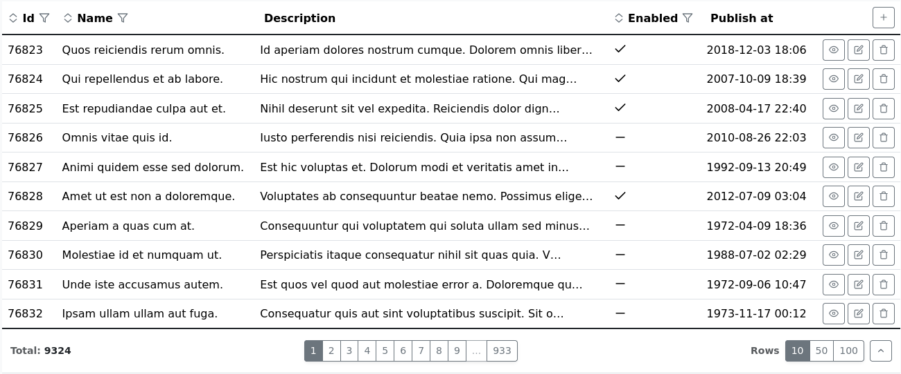

# AutoGridBundle

**🚀 [Demo Bundle](https://github.com/f0ska/auto-grid-test-bundle) | 📖 [Full Documentation](./docs/index.md) |
🛠 [Installation](./docs/installation.md)**

**AutoGridBundle** is a high-productivity Symfony bundle designed to eliminate boilerplate code. It automatically
generates a full-featured CRUD interface (Grids, Forms, Pagination, and Filters) for your Doctrine entities with **zero
initial configuration**.


---

## ✨ Key Features

* 🚀 **Zero Configuration:** Get a functional CRUD for any entity instantly without writing a single line of config.
* 🛠 **Advanced Form Guessing:** Out-of-the-box support for complex types, improving upon the standard Symfony Form
  Guesser.
* 🔍 **Automated Filters & Sorting:** Smart data filtering and sorting generated automatically based on your database
  schema.
* 💎 **Attribute-Based Customization:** Fine-tune your UI using PHP 8 Attributes directly in your Entities.
* 🔄 **Full CRUD Lifecycle:** Integrated views for Listing, Creating, Editing, and Deleting records.
* 🎨 **Extensible UI:** Easily override templates or extend the core logic to fit your custom requirements.

---

## 🔥 Example

###### Controller Example:

```php
public function myAction(AutoGridFactory $factory): Response
{
    $grid = $factory->create(MyEntity::class);
    return $grid->getResponse() ?? $this->render('my-template.html.twig', ['grid' => $grid]);
}
```

###### Twig Template Example:

```html
{{ agRender(grid) }}
```

###### Result:



## 📖 Explore more features:

* **[Full Documentation](./docs/index.md)**
  * [Bundle Installation](./docs/installation.md)
  * [Optional Factory Arguments](./docs/optional-factory-arguments.md)
  * [Attributes](./docs/attributes.md)
  * [Global Configuration](./docs/global-configuration.md)
  * [Customization](./docs/customization.md)
* **[Demo Bundle](https://github.com/f0ska/auto-grid-test-bundle)**

## ℹ️ Technical notice

AutoGrid is built for **Symfony 6+** and **PHP 8.1+**. It uses the **Bootstrap 5** theme and icons to display content
nicely.

_You will need to adapt AutoGrid templates if your project does not use Bootstrap 5.
However, this process is straightforward and much faster than building grids from scratch.
Initially, it's recommended to include the Bootstrap theme (even from a CDN) to see how it is supposed to look by
default.
This will help you customize AutoGrid templates for your specific theme._

---

