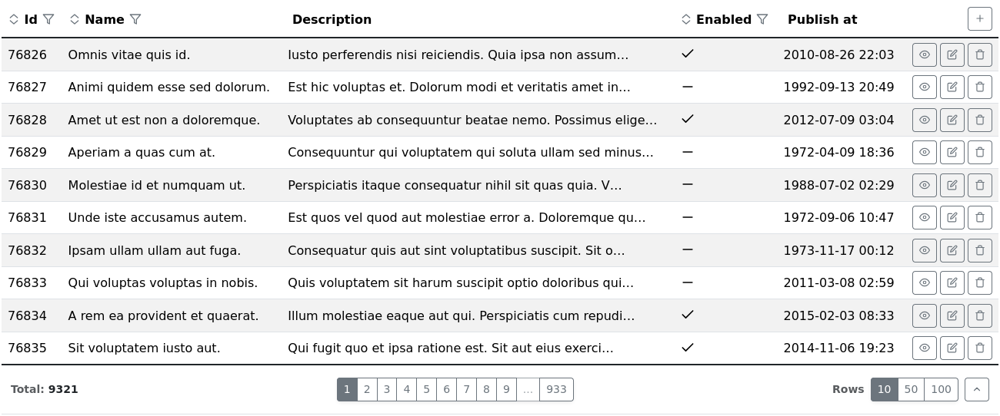

# AutoGridBundle

Automate the CRUD layer in Symfony by generating grids, forms, and filters directly from Doctrine entities.

[**Demo**](https://github.com/f0ska/auto-grid-test-bundle) | [**Documentation**](./docs/index.md) | [**Installation**](./docs/installation.md)

---

## Core Features

*   **Out-of-the-box CRUD**: Full List, Create, Edit, and Delete functionality with minimal setup.
*   **Metadata-driven UI**: Advanced form and filter detection using Doctrine metadata.
*   **Automatic Filtering**: Integrated search and sorting based on database schema.
*   **Attribute Configuration**: Fine-tune UI behavior directly in your Entity classes.
*   **Multi-theme Support**: Default support for Bootstrap 5, with experimental support for Bootstrap 4, Bulma, Flowbite, and Foundation.

---

## Implementation

### 1. Controller
```php
public function list(AutoGridFactory $factory): Response
{
    $grid = $factory->create(User::class);
    
    // AutoGrid handles form processing, redirects, and state internally
    return $grid->getResponse() ?? $this->render('admin/user.html.twig', ['grid' => $grid]);
}
```

### 2. Twig
```html
{{ ag_render(grid) }}
```

### 3. Default UI


---

## Technical Requirements
*   **PHP 8.1+**
*   **Symfony 6.4+**
*   **UI Framework**: Default templates use **Bootstrap 5**. The bundle now includes experimental support for **Bootstrap 4**, **Bulma**, **Flowbite**, and **Foundation**. For custom frameworks or deep overrides, see [template documentation](./docs/templates.md).

---


[Documentation Index](./docs/index.md) | [Installation](./docs/installation.md) | [Attributes](./attributes.md)
